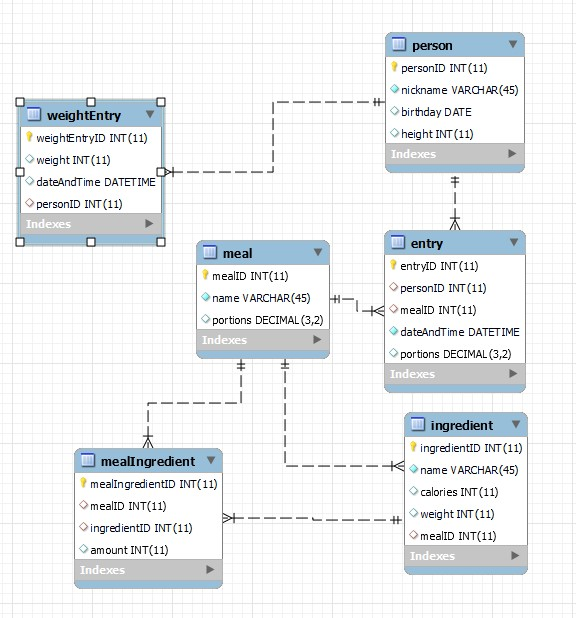
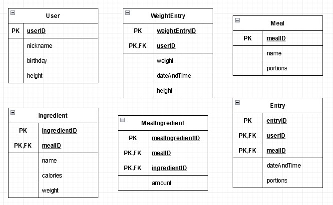

# Ruokapäiväkirja

## Projekti

Tietokannat TTC2020-3027

### Nimi

Matilda Stenius, AB8577

### Versio

v0.0.1

### Päiväys

21.4.2023

## Vaatimusmäärittely

### Johdanto

Harjoitustyön tavoitteena on tehdä tietokanta ruokapäiväkirjalle. Tarkoituksena on tallentaa päivän aikana syödyt ruuat ja näiden tiedot. Tärkeää on, että ei tarvitse syöttää samoja tietoja uudelleen esim. 100g perunaa muussissa on sama asia kuin 100g perunaa kinkkukiusauksessa. Ruokapäiväkirja menee usean ihmisen käyttöön ja käyttäjiä voi olla useampia. Tietokannan tietojen avulla pitäisi pystyä laskemaan päivän kalorit ja seuraamaan painoa.

Tämän harjoitustyön on tarkoitus olla minimi versio ilman ylimääräisiä tietoja. Näin se pysyy yksinkertaisena ja käyttäjiltä voi saada palautetta nopeammin.

Tietokanta rajataan mobiili ja web-käyttöliittymien käyttöön.

### Yleiskuvaus

TODO eka versio omal koneel
TODO eka versio pelkkä tietokanta
TODO toteutustyökalu workbench ja jamkin mariadb
TODO Oikeuksien hallinta yms. rajataan ensimmäisen version ulkopuolelle

Käyttäjiä on seuraavanlaisia:

- Käytäjä voi haluta tarkkailla painoaan eri päivinä.
- Toinen käyttäjä voi haluta kirjata ylös eri ruoka annoksia.
- Käyttäjä voi haluta laskea kaloreita.
- Käyttäjä haluaa valmiin annosreseptin laskettuna ruoka-ainesosien kalorit.

### Toiminnot

#### Esimerkkiraportit

TODO päivän kalorit
TODO painon seuranta

#### Käyttäjien ylläpito

- käyttäjäID (PK)
- nimimerkki (Pakollinen)
  - Nimimerkki pakollinen, ei tarvitse olla oma henkilökohtainen nimi tietosuoja syistä.
- syntymäaika
  - Teknisestä näkökulmasta hyödyllinen laskemaan terveys kaavoja, mutta tietosuoja syistä ei pakollinen.
- pituus
  - Pituus on hyvä olla terveys laskennojen takia, mutta ei ole pakollinen, jos käyttäjällä ei ole tarvetta näihin ominaisuuksiin.

#### Painonmittausten ylläpito

- painonmittausID (PK)
- paino (Pakollinen)
  - Pakolinen, koska painomittaus ilman painoa ei ole järkevä.
- päivämäärä ja aika (Pakollinen)
  - Pakollinen, jotta päästään seuraamaan painon kehitystä.
- käyttäjäID (FK)

#### Ruoka-annosten ylläpito

- ruoka-annosID (PK)
- nimi (Pakollinen)
- annosmäärä (Pakollinen)

#### Ruoka-ainesten ylläpito

- ruoka-aineksetID (PK)
- nimi (Pakollinen)
- kalorit (Pakollinen)
  - Pakollinen, jotta voidaan laskea annoksen kalorimäärä. Voi muuttua käyttäjäpalautteen myötä.
- paino (Pakollinen)
  - Pakollinen, jotta voidaan laskea annos. Käyttäjiltä voidaan myöhemmin kysyä palautetta, onko tarvetta muille painoille.
- ruoka-annosID (FK)

#### Annoksen ainesten ylläpito

- annoksenAineksetID (PK)
- ruoka-annosID (FK)
- ruoka-aineksetID (FK)
- määrä (Pakollinen)

#### RuokailuKirjausten ylläpito

- kirjausID (PK)
- käyttäjäID (FK)
- ruoka-annosID (FK)
- päivämäärä ja aika (Pakollinen)
  - Voidaan seurata mihin aikaan mikäkin merkintä on tapahtunut.
- annosmäärä (Pakollinen)

### Ulkoiset liittymät

    --- Tässä voidaan täsmentää luvussa 2 yleisellä tasolla esitettyä kuvausta järjestelmän liitynnöistä. Esimerkiksi käyttöliittymän tarkempi kuvaus sekä liitynnät muihin järjestelmiin, oheislaitteisiin ja tietoliikenneyhteyksiin. ---

### Muut ominaisuudet

    --- Kuvataan järjestelmältä vaadittavat ei-toiminnalliset ominaisuudet: suorituskyky, käytettävyys, toipuminen virhetilanteista, turvallisuus, ylläpidettävyys, siirrettävyys jne. Esitä vaatimus siten, että se on testattavissa ja mitattavissa. ---

