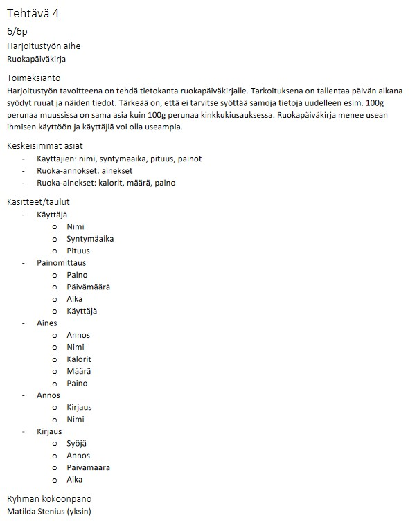
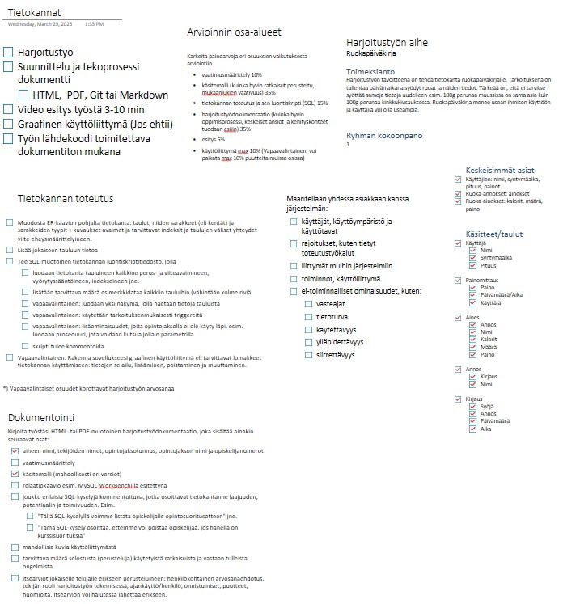
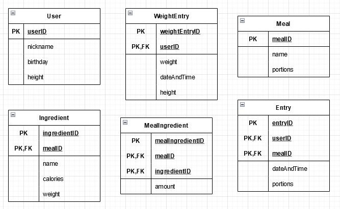
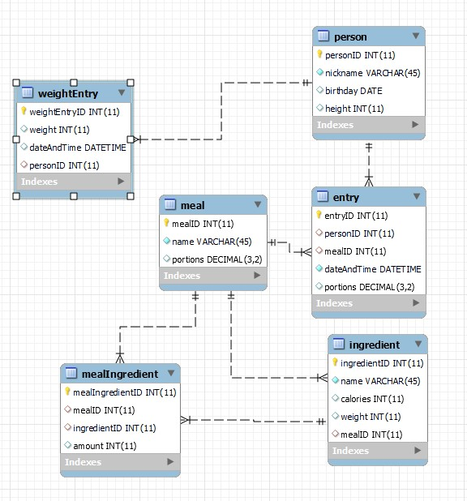
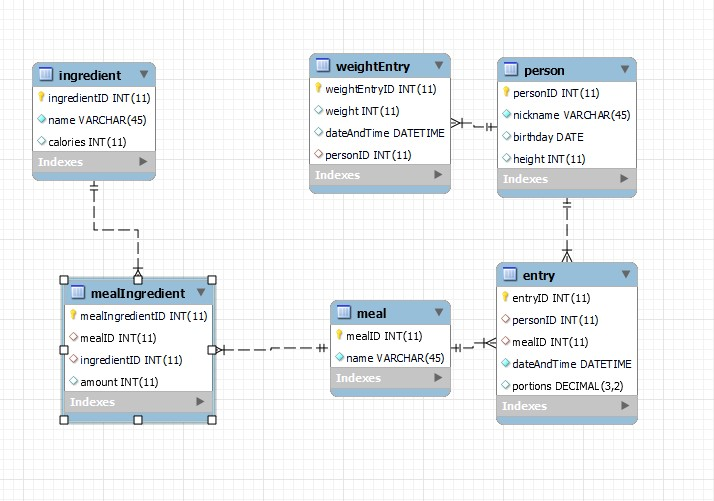

# Ruokapäiväkirja

## Tiedot

Ruokapäiväkirja, Tietokannat TTC2020-3027, Matilda Stenius, AB8577, v0.0.1, 21.4.2023

## Suunnittelu

Alkuperäinen suunnitelma oli suppeahko:

Alkuperäinen suunnitelma kuvasi hyvin aihetta, mutta sen pohjalta ei voinut lähteä toteuttamaan.

Tästä syystä laadin kattavat muistiinpanot harjoitustyötä varten OneNote ohjelmassa seuraavalla tavalla:

Suunnitteluvaiheessa joutui karsimaan, koska oleellisinta oli saada kehitysversio aikaiseksi ja saada tietoa kantaan ja tietoa kannasta ulos. Kehitys oli iteratiivista ja kokeilin toiminnallisuutta ja jatkuvasti muutin kannan rakennetta. Mm. tuotantoon liittyvät seikat kuten tietoturva, vasteajat yms. jäivät taka-alalle, koska oli tosi paljon tekemistä ydinasioiden parissa.

Tässä on esimerkki hahmotelmasta drawio ohjelmalla:

Ja keskeneräinen tietokanta:

Ja lopullinen tietokanta:

## Toteutus

Toteutuksen vaatimusmäärittely löytyy [Vaatimusmäärittely.md](Vaatimusmäärittely.md) tiedostosta.

Koodit löytyy [Tietokantojenluonti.sql](Tietokantojenluonti.sql) ja [Testikyselyt.sql](Testikyselyt.sql) tiedostoista.

Toteutus sujui iteratiivisesti ja keskityin siihen, että logiikka toimii. Logiikassa löytyi paljon pieniä virheitä ja sain ne korjattua yksi kerralla. Käytin Workbenchia ja Jamkin MariaDB:tä, mutta tarvittavat taulut voi luoda minne tahansa tietokantaan mm. IT:n valmistelemalle palvelimelle kuten nyt Jamkin palvelin.

Tein myös testidatan ja testikyselyn ja testailin logiikan toimivuutta. Graafiselle käyttöliittymälle ei jäänyt aikaa, koska en osaa vielä tehdä web sovelluksia niin hyvin, ettei harjoitustyön tuntimäärä pauku.

## Ajankäyttö

- Suunnittelu 12h
  - Suunnitteluun meni hurjasti aikaa, koska kokonaisuus oli iso ja piti ottaa paljon asioita huomioon. Suunnitelma myös muuttui jatkuvasti, kun tajusi ettei oma ajatus ollut fiksu.
  - Projektin muistiinpanoihin ja jäsentelyyn meni myös paljon aikaa.
- Vaatimusmäärittely 4h
  - Vaatimusmäärittelyn tekemiseen meni myös paljon aikaa, koska vaatimusmäärittelyn käsite oli itselle täysin uusi.
- Tietokannan luominen 16h
  - Tietokannan luominen oli hankalaa, koska logiikan suunnittelma ei toiminutkaan vaan ymmärsin toiminnan vasta kun pääsi kokeilemaan. Tämä iteratiivinen kehitys oli hidasta ja virheiden löytämiseen välillä kesti tunteja.
- Dokumentaatio 4h
  - Dokumentaation kirjoittamiseen, kuvien laatimiseen yms. meni yllättävän paljon aikaa.

## Itsearvio

Opin hurjasti varsinkin suunnittelusta ja vaatimusten määrittelystä ja tietokannan luomisesta. Parantamisen varaa on ja mm. kyselyjä olisi voinut enemmän ja monimutkaisempia. Dokumentaatio on myös hieman puutteellinen ja sitä olisi voinut parantaa. Jos ohjelmointitaito olisi parempi, niin ehtisin tehdä myös graafisen käyttöliittymän.

Annan itsearvioinnin kokonaisarvosanaksi 3.